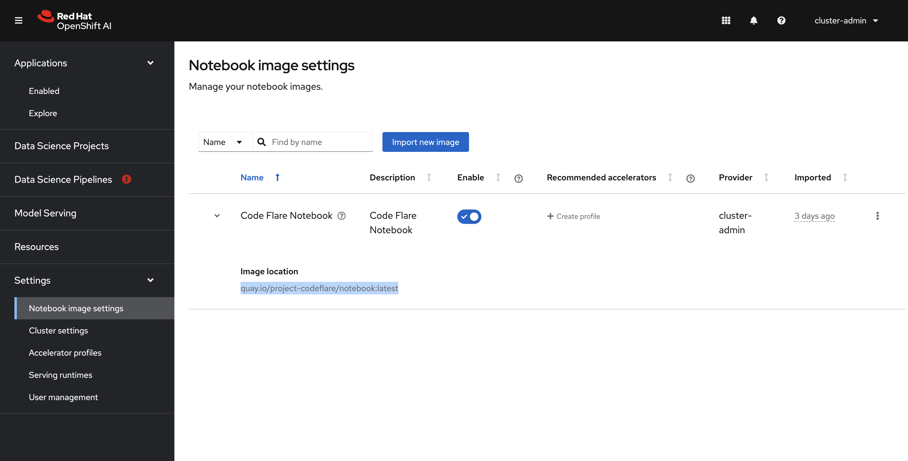
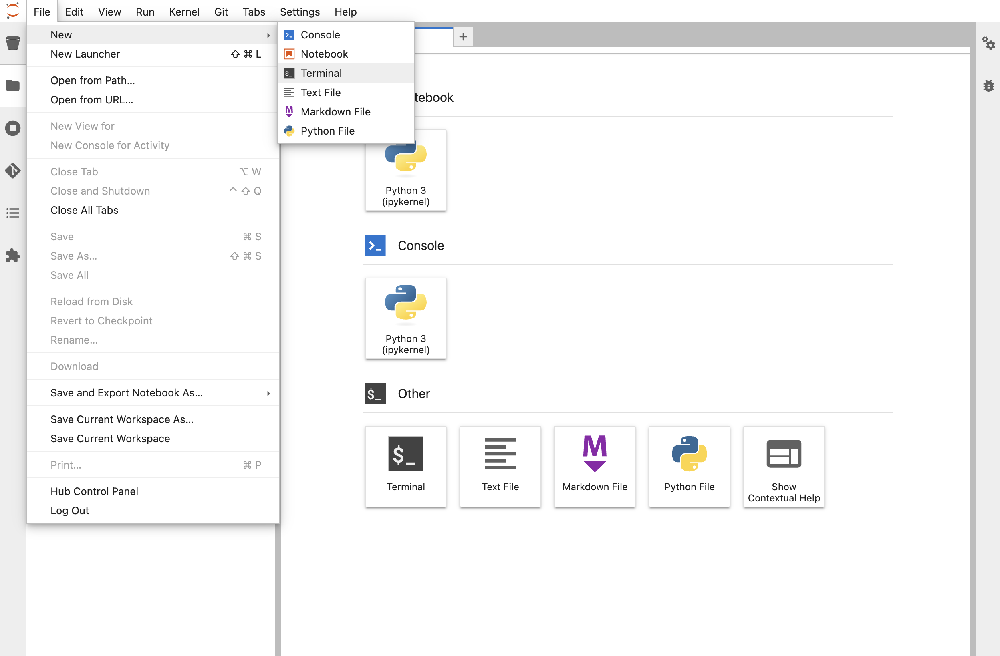
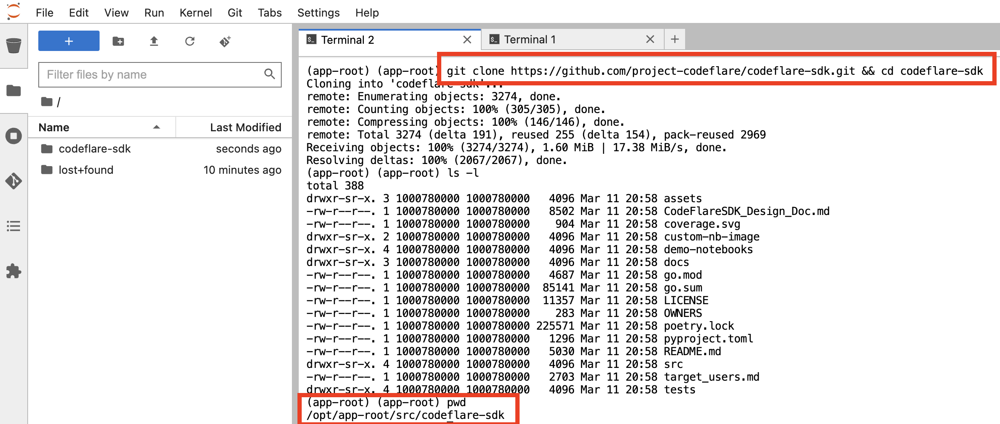
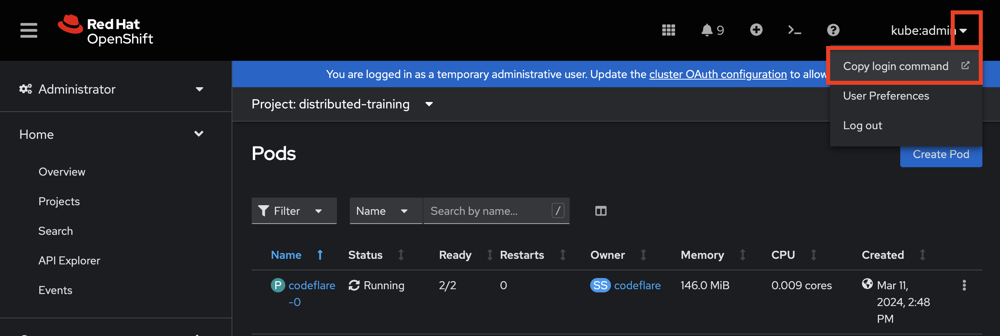
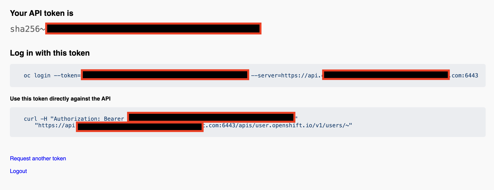
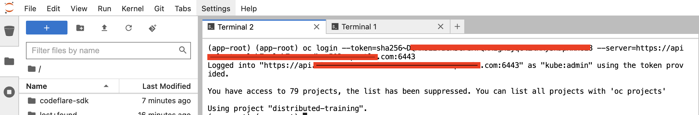
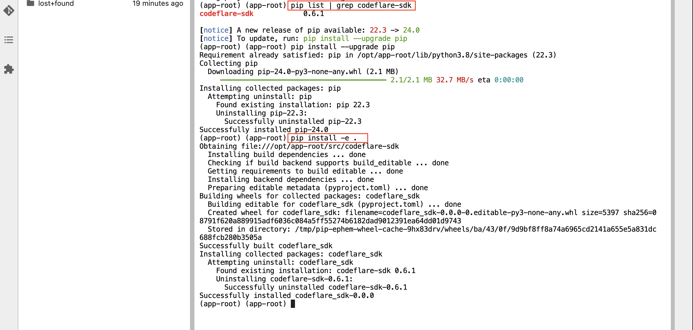

# CodeFlare on OpenShift

Codeflare and ray setup for distributed training on OpenShift

Overview:
1. import CodeFlare-Notebook image from Quay.io
1. Luanch

## Getting Started

To provision the cluster I followed these steps [demo-ai-gitops-catalog](https://github.com/redhat-na-ssa/demo-ai-gitops-catalog?tab=readme-ov-file#bootstrapping-a-cluster)

As a cluster-admin you can import new notebook images.

Import the CodeFlare-Notebook image from `quay.io/project-codeflare/notebook:latest`


Launch a workbench with CodeFlare notebook image


Launch a `Terminal`


Git clone in the codeflare-sdk


Get your cluster API token



Copy and Paste your oc login command


Upgrade pip and the latest codeflare


Launch one of the notebooks in the codeflare-sdk > demo-notebooks > guided-demos

[!NOTE]
Import and add the following to mute the warnings in the notebooks
```
import warnings
warnings.filterwarnings('ignore')
```

See the codeflare-sdk > demo-notebooks > guided-demos for the different examples